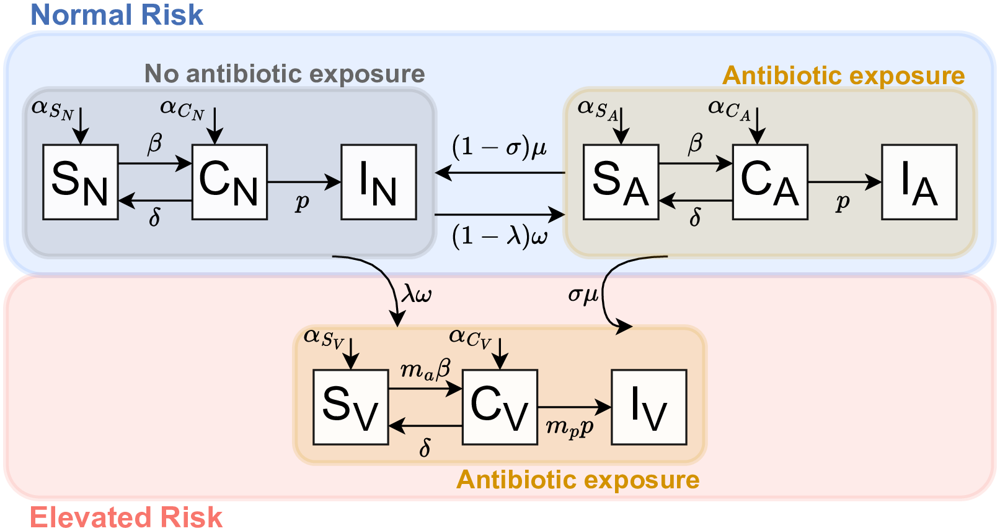
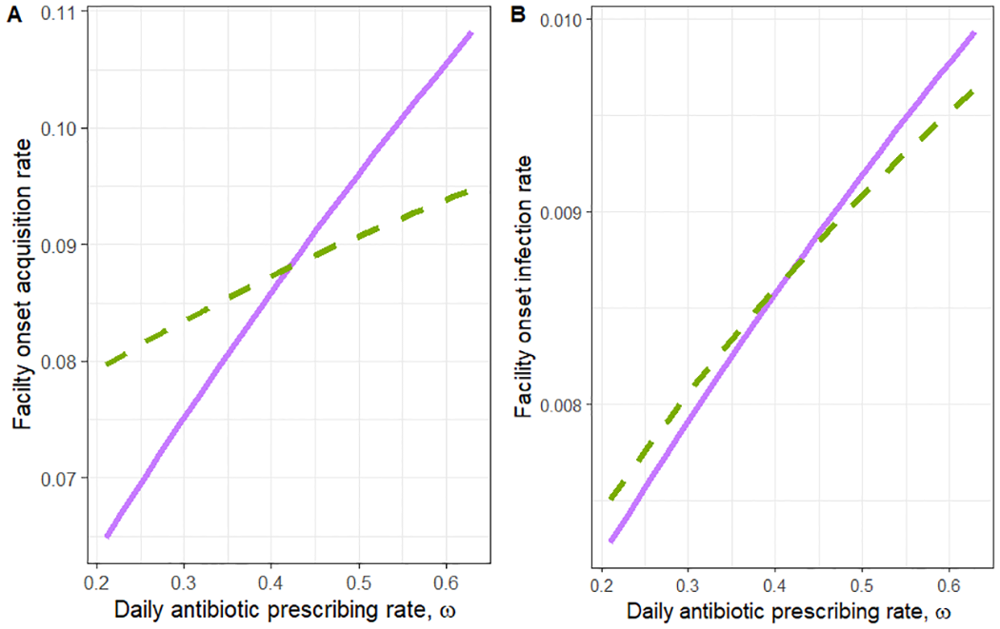

# Importance of underlying mechanisms for interpreting relative risk of Clostridioides difficile infection among antibiotic-exposed patients in healthcare facilities

by Christopher Mitchell, Lindsay Keegan, Thuy Le, Karim Khader, Alexander Beams, Matthew Samore, Damon Toth

This paper is published at [PLOS One](https://journals.plos.org/plosone/article?id=10.1371/journal.pone.0306622).

## Description
*Clostridioides difficile* (*C. difficile*) is the leading cause of healthcare-associated diarrhea worldwide. *C. difficile* infection (CDI) is characterized by diarrhea that can lead to life-threatening colon inflammation and is one of only five pathogens classified by the Centers for Disease Control and Prevention as an urgent threat. The relationship between antibiotic exposure and CDI indicates an opportunity to reduce the burden of CDI through antibiotic stewardship, especially given that up to 30% of all antibiotic prescribing in the United States is considered unnecessary or inappropriate. To quantify the impact of antibiotics on both acquisition and progression we develop a model of hospital-associated *C. difficile* infections (Figure 1). This was done using a deterministic system of ordinary differential equations. We then apply our model to different classes of antibiotics to understand how these different classes of antibiotics impact susceptibility and progression to understand how this may impact potential interventions including the impact of reducing the frequency of antibiotic prescribing, shortening the duration of high-risk antibiotic courses, and shifting antibiotic prescriptions away from classes linked to CDI. 

  

Figure 1: Schematic of the mechanistic model of *C. difficile* disease dynamics and antibiotic risk states.

We find that the impact of two antibiotic stewardship interventions on facility acquisition and progression from colonization is as expected, by decreasing the overall antibiotic prescribing rate both the rate of acquisition and the rate of progression to CDI decrease (Fig 3). While we find that both the acquisition rate and the rate of progression to CDI decrease with decreased antibiotic prescribing, we find our results are not robust to the assumptions on the relationship between mp and ma, the scaling factors for increased progression and increased acquisition for patients in the elevated risk state (Figure 2).

  

Figure 2: Plot of the intervention of reducing the overall prescribing rate.

The relationship between the overall antibiotic prescribing rate (ω) and the (a) rate of facility-onset acquisition and (b) rate of facility-onset infection. The solid line depicts the relationship between antibiotic prescribing (assuming higher vulnerability to acquisition) and either facility-onset acquisition or infection when using the values of ma and mp (ma = 13.25 and mp = 1.29) and the dotted line corresponds to the same relationship (assuming higher vulnerability to progression) as the solid line but for the values of ma and mp (ma = 1.59 and mp = 3.31). 

The main finding of our paper is that when calibrating our model to given targets including the equilibrium disease prevalence, equilibrium infection prevalence, and the risk ratio, we find that the two key parameters, the differential rate of progression (mp) and the differential rate of acquisition (ma) of elevated risk individuals are not identifiable. We find a curve that describes the relationship between these two parameters such that for every value of one parameter, there exists a value of the other parameter that satisfies the constraints imposed. We show that this identifiability problem percolates forward and leads to contradictory results for antibiotic stewardship interventions. 

## Abstract
*Clostridioides difficile* infection (CDI) is a significant public health threat, associated with antibiotic-induced disruption of the normally protective gastrointestinal microbiota. CDI is thought to occur in two stages: acquisition of asymptomatic colonization from ingesting *C. difficile* bacteria followed by progression to symptomatic CDI caused by toxins produced during *C. difficile* overgrowth. The degree to which disruptive antibiotic exposure increases susceptibility at each stage is uncertain, which might contribute to divergent published projections of the impact of hospital antibiotic stewardship interventions on CDI. Here, we model *C. difficile* transmission and CDI among hospital inpatients, including exposure to high-CDI-risk antibiotics and their effects on each stage of CDI epidemiology. We derive the mathematical relationship, using a deterministic model, between those parameters and observed equilibrium levels of colonization, CDI, and risk ratio of CDI among certain antibiotic-exposed patients relative to patients with no recent antibiotic exposure. We then quantify the sensitivity of projected antibiotic stewardship intervention impacts to alternate assumptions. We find that two key parameters, the antibiotic effects on susceptibility to colonization and to CDI progression, are not identifiable given the data frequently available. Furthermore, the effects of antibiotic stewardship interventions are sensitive to their assumed values. Thus, discrepancies between different projections of antibiotic stewardship interventions may be largely due to model assumptions. Data supporting improved quantification of mechanistic antibiotic effects on CDI epidemiology are needed to understand stewardship effects better.

## Software implementation

All source code used to generate the results and figures in the paper are in the `code` folder. 

## Dependencies

The following R packages are required for this project:

- [`ggplot2`](https://cran.r-project.org/package=ggplot2): for data visualization.
- [`cowplot`](https://cran.r-project.org/package=cowplot): for publication-quality plots and arranging multiple plots.

# Contact
For inquiries, please contact lindsay.keegan@utah.edu
